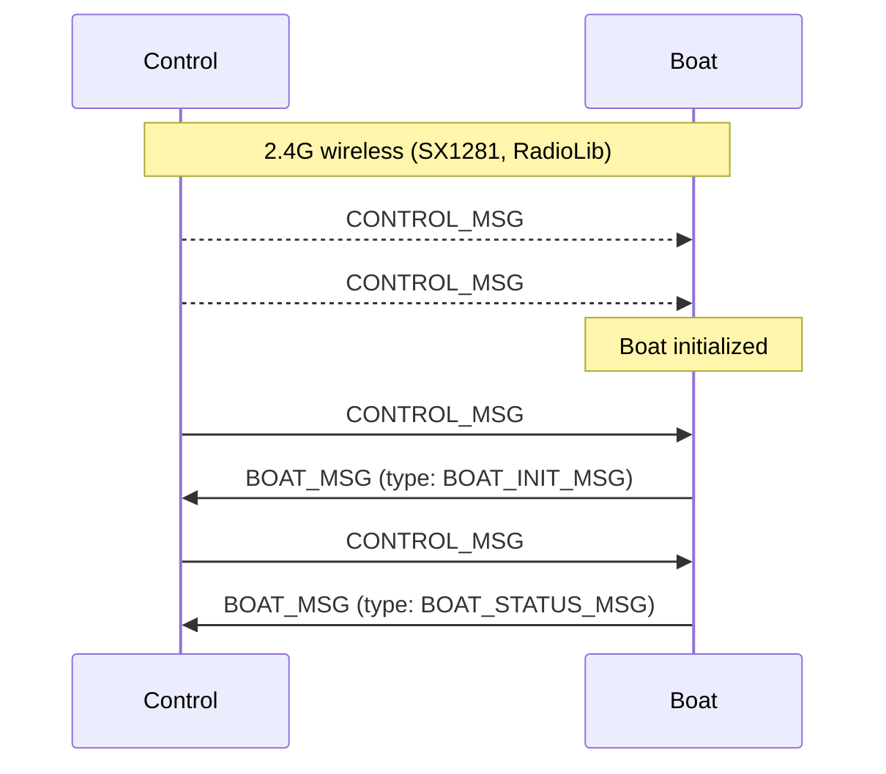
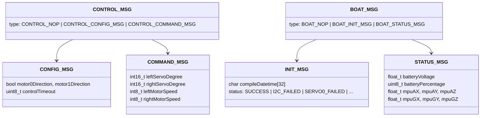
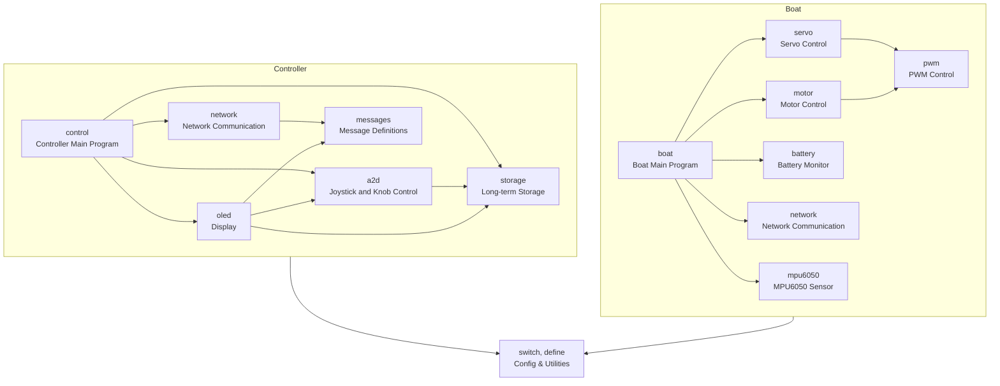

<!--
 Copyright (C) 2025 langningchen
 
 This file is part of innovation.
 
 innovation is free software: you can redistribute it and/or modify
 it under the terms of the GNU General Public License as published by
 the Free Software Foundation, either version 3 of the License, or
 (at your option) any later version.
 
 innovation is distributed in the hope that it will be useful,
 but WITHOUT ANY WARRANTY; without even the implied warranty of
 MERCHANTABILITY or FITNESS FOR A PARTICULAR PURPOSE.  See the
 GNU General Public License for more details.
 
 You should have received a copy of the GNU General Public License
 along with innovation.  If not, see <https://www.gnu.org/licenses/>.
-->

# Innovation for the Future

The school has an event called "Innovation for the Future", which requires each group to design an innovative ship model. The ship model should be able to sail on water and can be made of any material. The design should be creative and practical, and the ship model should be able to carry a certain amount of weight. The event encourages students to think outside the box and come up with unique ideas for their ship models.

## Network communication

The ship model should be able to communicate with a controller via a 2.4G wireless network. 

#### Network Communication Architecture

#### Network Message Structure

## Project Structure

